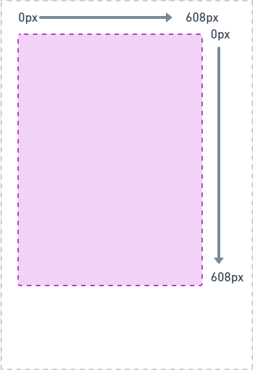
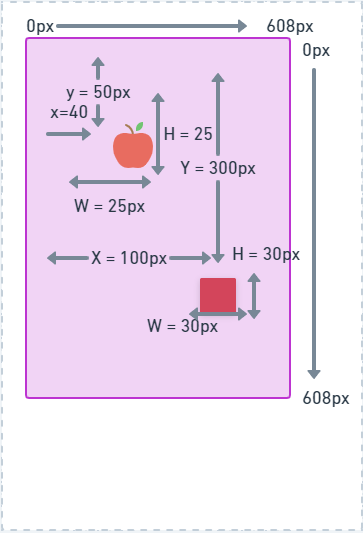
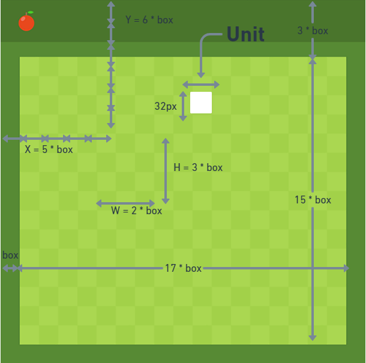
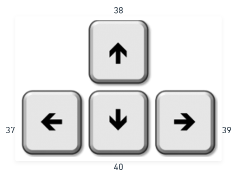
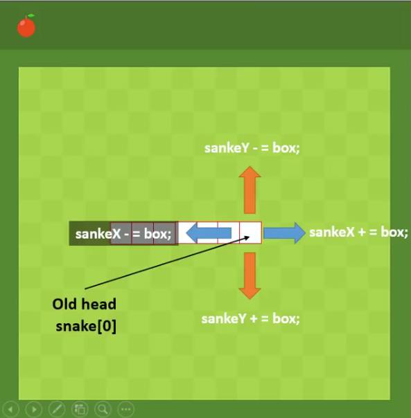
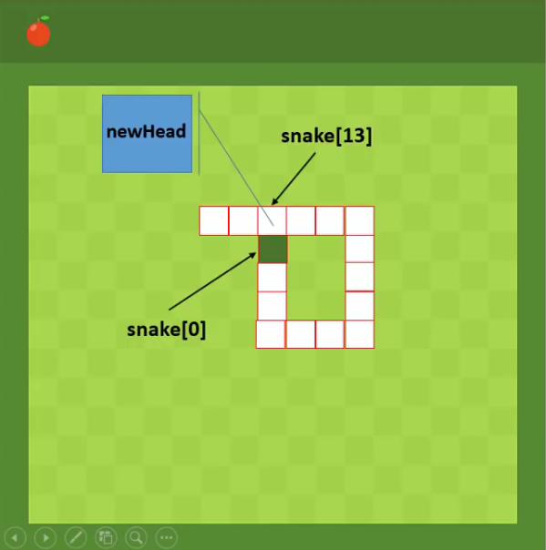
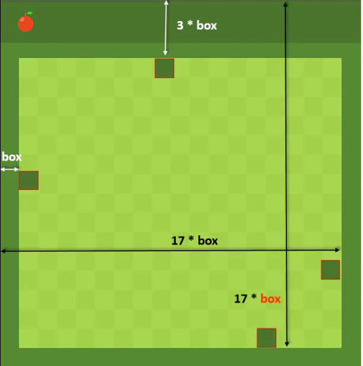

# Code the Snake Game

Projeto Referente ao Bootcamp HTML Web Developer da Digital Innovation One.

Atividade: Recriando o jogo da cobrinha com JavaScript

# Tecnologias Utilizadas:

- HTML5
- CSS
- JavaScript
- Visual Studio Code
- Notion
- Whimsical

# HTML5

<canvas id ="canvas" width="608" height="608">

</canvas>

# JS

const cvs = document.getElementById('canvas');

const ctx = cvs.getContext('2d') // Methods Properties

### Load Images

let imageName = new Image();

imageName.src = "path/img.png";

let audioName = new Audio();

audioName.src = "path/audio.mp3";

audioName.play();

### Draw Images

ctx.drawImage(imageName, X , Y  , Width, Height);

ctx.drawImage(       img      , 40, 50,    25   ,    25    );

### Draw Rectangle

ctx.fillStyle = "red"; 

ctx.fillRect (100, 300,    30 ,           30 );

                    👆   👆     👆            👆  

                     X  ,   Y ,   Width ,   Height

px

letbox = 32

ctx.fillStyle = "black"

ctx.fillRect(5*box, 6*box, 2*box, 3*box);

# Snake && ground && food && score

let snake = [];

snake[0] = {x : 9 * box, y : 10 * box};//posição inicial da Snake

snake[1] = {x : 8 * box, y : 10 * box};// posição 2 da Snake

let food = {

    x : Math.floor(Math.random() * 17 + 1) * box //Math.floor - retorna o menor número inteiro dentre o número "x"; Math.random - retorna um número pseudo-aleatório no intervalo

    y : Math.floor(Math.random() * 15 + 3) * box};

}

let score = 0;

function draw(){

ctx.drawImage(ground, 0, 0);

for(let i = 0; i < snake.legth; i++){//ler a Snake inteira

    ctx.fillStyle = (i == 0)? "green" : "white";//preencher a box com a Snake (no início i == 0) com a cor

    ctx.fillRect(snake[i].x, snake[i].y, box, box);//posição da Snake 

    ctx.strokeStyle = "red"; //cor da borda da Snake

    ctx.strokeRect(snake[i].x, snake[i].y, box, box);//posição da borda da Snake

}

ctx.drawImage(foodImg, food.x, food.y);//Desenhar a imagem da comida

ctx.fillStyle = "white";

ctx.font = "45px Changa One";

ctx.fillText(score, 2 * box, 1.6 * box);//Score do jogo

}

let game = setInterval(draw, 100);

# Control the Snake

## Every KEY on the KEYBOARD has a CODE

 

let d;

document.addEventListener("keydown", direction); //ao ouvir o evento keydown, startar a função direction.

function direction(event) {//verifica qual tecla foi apertada

if(event.keycode == 37 && d != "RIGHT"){//se apertar a tecla 37(esquerda), para que a Snake não possa voltar pela parte de trás, colocamos a condição.

    d = "LEFT";

}else if(event.keycode == 38 && d != "DOWN"){

    d = "UP";

    }else if(event.keycode == 39 && d != "LEFT"){

    d = "RIGHT";

}else if(event.keycode == 39 && d != "UP"){

    d = "DOWN";

}

## How Snake Moves

Array = [9, 0, 1, 2, 3,      ]                       

        👆               👆 Array.pop

Array.unshift(9)

---

snake.pop();

### Old head position

snakeX = snake[0] . x; //Old head Position

snake.Y = snake[0] . y; //Old head Position

### One of the directions

snakeX += box;

snakeX -= box;

snakeY -= box;

snakeY += box;

let newHead = {

    x: snakeX,

    y: snakeY

}

snake.unshift(newHead);

# When Snake eats food

if(snakeX == food.x && snakeY == food.y){ //se a cabeça da Snake estiver no mesmo lugar que a comida...
    //adicionamos outra cabeça sem snake.pop()
    score++;

    food = {

    x: unit * Math.floor(Math.random() * 17 + 1),

    y: unit * Math.floor(Math.random() * 15 + 3),
}else{

}

# GAME OVER

//quando a Snake sofre uma colisão

//vamos observar se a cabeça da Sanke sofre alguma colisão com qualquer parte da Snake.

function collision(newHead, snake) {

    for(let i = 0; i < snake.lenght; i++){ //percorre a Snake

        if(newHead.x == snake[i].x && newHead.y == snake[i].y){ // caso haja colisão

            return true;
        }
    }
    return false;
}

---

snake < box || snake < 3 * box

# Citações

Agradecendo a @digitalinnovationone por dar oportunidade de melhorar minha capacidade de "codar", e melhorar também meu portifólio.

Ao Canal @CodeExplained do Youtube, onde pesquisando no que poderia melhorar meu código encontrei um professor exelente que  explicou o passo a passo da criação do jogo (conforme acima)